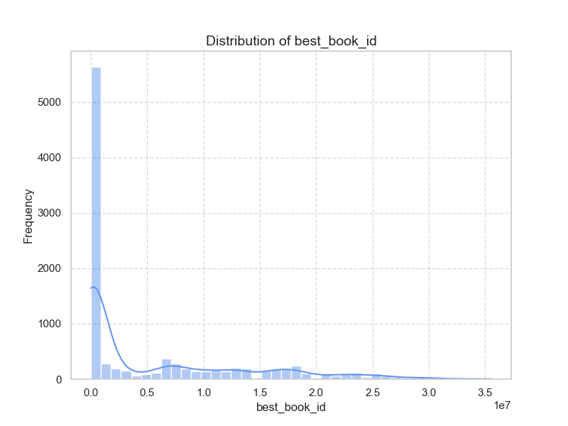
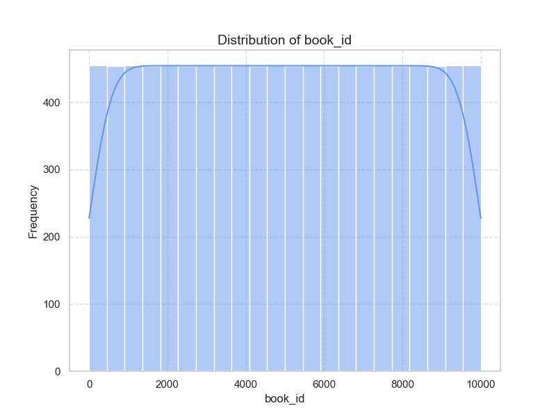

### Summary of 'goodreads.csv' Data

**General Overview:**
The dataset contains information about 10,000 books with various attributes including IDs, counts, ratings, reviews, titles, authors, and publication years. Below are the key statistics extracted as well as trends observed:

#### Summary Statistics:

1. **IDs and Counts:**
   - The dataset includes four main identifiers: `book_id`, `goodreads_book_id`, `best_book_id`, and `work_id`. Each has around 10,000 entries.
   - The average number of books per author is approximately 75 (mean of `books_count`), with a maximum of 3,455, indicating a substantial number of prolific authors.

2. **Publications:**
   - Published books range from as far back as 1750 to 2017, centering around years in the 2000s, showing a significant skew toward more recent publications (mean publication year is 1982).
   - A notable number of missing values (21 out of 9,979 for `original_publication_year`) may skew the analysis of historical context.

3. **Ratings:**
   - Average ratings tend to be high (mean average rating is approx. 4.00), indicating a tendency for well-received books in this dataset.
   - Ratings distribution shows a positive trend with the majority of the ratings for books clustering more prominently in the 4- and 5-star categories. 
   - The high standard deviations in the rating categories imply varying reception among different books.

4. **Authors and Language:**
   - The dataset represents a total of 4,664 unique authors, which suggests a diverse range of books.
   - Most books are in English (`language_code`), with `eng` appearing 6,341 times.

5. **ISBN and Titles:**
   - There are missing values for `isbn` (700 missing) and `isbn13` (585 missing), possibly necessitating a closer examination of validity and data integrity across records.
   - Unique titles number around 9,964 with some titles having multiple editions or reprints (top frequency of title is 'Selected Poems').

6. **Images:**
   - The dataset shows duplicate URLs for images, indicating one photo could represent multiple books.

#### Correlation Matrix Insights:

- **Negative Correlations:**
  - The `books_count` has a moderately negative correlation with key metrics like `ratings_count` and `work_text_reviews_count`, suggesting that as the number of books increases for an author, individual books may receive less overall attention.
  
- **Positive Correlations:**
  - The `ratings_count`, `work_ratings_count`, and the ratings fields (`ratings_1` to `ratings_5`) display strong positive correlations, suggesting a reliable relationship where increased ratings typically lead to higher counts in reviews and exceptional feedback.

#### Areas Needing Further Analysis:

1. **Missing Data:**
   - Investigate the impact of missing values in `isbn`, `isbn13`, and `original_title`, as well as incomplete data for `original_publication_year`. Understanding how these gaps affect overall analysis could be beneficial.

2. **Review Quality vs. Quantity:**
   - Further analysis of `work_text_reviews_count` in relation to ratings and authorship could uncover if higher reviews correlate to quality or quantity. There may also be scope to consider text sentiment analysis on the reviews themselves.

3. **Publication Trends Over Time:**
   - Delve deeper into trends over the years of publication to analyze shifts in popular genres, author demographics, or reader preferences over decades, particularly how ratings have changed for historical vs. contemporary works.

4. **Genre Analysis:**
   - Information on book genres isn't available, and adding it could enrich the analysis significantly, revealing patterns in reader preferences and success metrics.

5. **Cultural and Language Impact:**
   - Examine how language impacts ratings and reviews, especially considering the dataset primarily comprises English books while having a diverse list of authors.

Overall, the dataset provides a fruitful basis for exploration into reading trends, author success criteria, and the reception of literature. Further inquiries into the identified areas could yield compelling insights about literary popularity and cultural significance.

Based on the provided correlation matrix, we can identify several key variables that exhibit significant correlations with each other. Below are some observations regarding these correlations and potential causal relationships. 

### Key Variables with Significant Correlations

1. **Ratings Count**:
   - **Strong correlations** with:
     - `work_ratings_count` (0.995) 
     - `work_text_reviews_count` (0.779)
     - All individual rating counts (`ratings_1`, `ratings_2`, `ratings_3`, `ratings_4`, `ratings_5`) range from 0.723 to 0.978.
   - **Interpretation**: Higher ratings count suggests that the book has been rated more times, which likely leads to a higher `work_ratings_count` and `work_text_reviews_count`. 

2. **Work Ratings Count**:
   - **Strong correlations** with:
     - `ratings_count` (0.995) 
     - Individual ratings (`ratings_1`, `ratings_2`, `ratings_3`, `ratings_4`, `ratings_5`) also correlate highly (between 0.718 and 0.987).
   - **Interpretation**: This variable indicates the number of ratings that are considered for the overall quality of the book.

3. **Books Count**:
   - **Moderately strong correlations** with:
     - `ratings_count` (0.324)
     - `work_ratings_count` (0.333)
   - **Interpretation**: More books in the dataset may correlate with having more ratings, perhaps because of broader exposure.

4. **Work Text Reviews Count**:
   - **Moderate correlations** with:
     - `ratings_count` (0.779)
     - `work_ratings_count` (0.807)
     - This indicates that as books receive more ratings, they tend to also receive more text reviews.
   - **Interpretation**: In general, books that are rated more often might also motivate readers to leave more detailed reviews.

5. **Average Rating**:
   - **Moderate negative correlations** with:
     - `ratings_1` (-0.077), `ratings_2` (-0.116), `ratings_3` (-0.065), `ratings_4` (0.036), `ratings_5` (0.115).
   - **Interpretation**: The average rating demonstrates a mixed relationship with individual ratings, highlighting that ratings are slightly dispersed around the average.

6. **Original Publication Year**:
   - **Moderate negative correlation** with `books_count` (-0.322).
   - **Interpretation**: Newer books might have a higher count in the system or collection, which can reflect current reading trends.

### Possible Causal Relationships

1. **Increased Author Exposure**:
   It is plausible that as a book receives more ratings (i.e., higher `ratings_count`), it gains more visibility, leading to more ratings and reviews. Higher quality books may attract more reviews, creating a feedback loop. 

2. **Quality Indicators**:
   A book with a high `average_rating` could lead to more ratings, attracting more readers and further information such as text reviews. This could suggest a quality-driven popularity, where positive reception begets more ratings and engagement.

3. **Collective Reputation of Works**:
   If a particular author or series has a high `work_ratings_count`, it might positively influence the `ratings` of subsequent works. This can lead to a network of ratings heavily influenced by the author's reputation.

4. **Cultural Shifts in Reading**:
   As books released in specific publication years gain popularity or are discussed in social or cultural contexts, there may be an increase in reviews for those books, showing how temporal factors affect reader engagement.

5. **Higher Ratings and Reader Engagement**:
   An increase in higher ratings (like `ratings_4` and `ratings_5`) may correlate with an increased `work_text_reviews_count`, suggesting satisfied readers are eager to write about books they enjoy, fostering a positive feedback loop into the book's reputation.

### Conclusion

These correlations suggest a complex interrelationship between reader ratings, book visibility, and reader engagement. While correlations can hint at potential causal relationships, further investigation such as regression analysis or experiments would be necessary to establish causation definitively.

