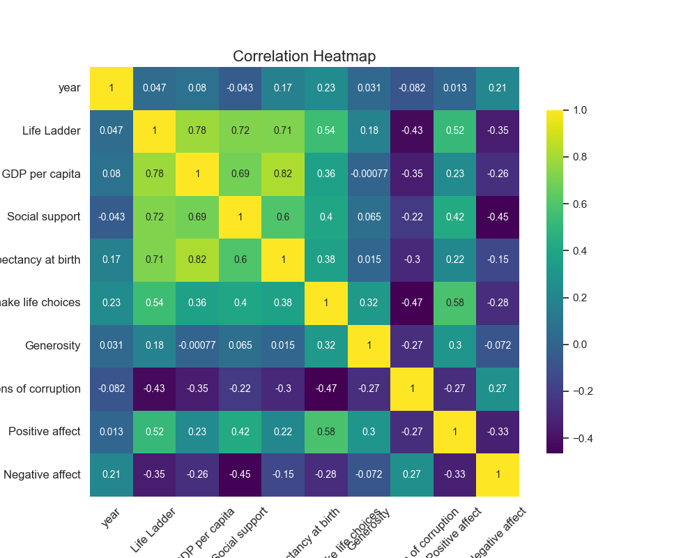
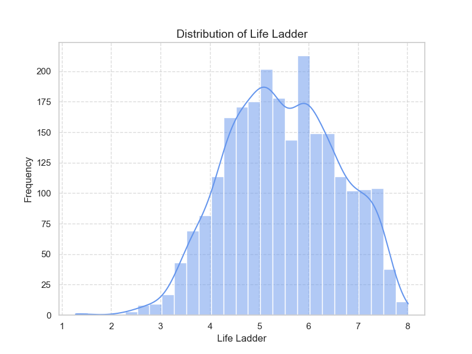
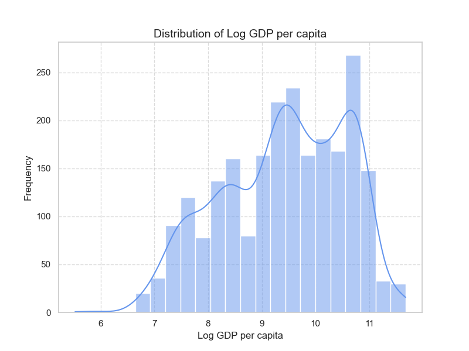
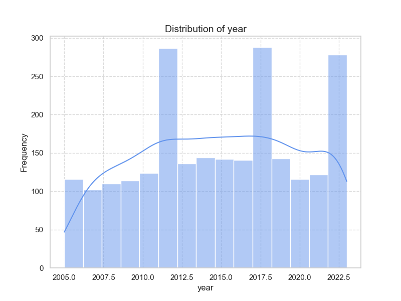

### Summary of 'happiness.csv' Data

#### General Overview

The dataset contains happiness-related metrics from 2363 entries across 165 countries, spanning from 2005 to 2023. The main variables measured include the "Life Ladder" (a measure of happiness), "Log GDP per capita", "Social support", "Healthy life expectancy at birth", "Freedom to make life choices", "Generosity", "Perceptions of corruption", "Positive affect", and "Negative affect". 

#### Summary Statistics

1. **Country Name**:
   - Total Entries: 2363
   - Unique Countries: 165
   - Most Frequent Country: Argentina (18 occurrences)
   
2. **Year**:
   - Mean: approximately 2014.76
   - Range: 2005 to 2023
   - Standard Deviation: 5.06 years

3. **Happiness Metrics**:
   - **Life Ladder**: 
     - Mean: 5.48
     - Range: 1.281 (min) to 8.019 (max)
     - Standard Deviation: 1.13
   - **Log GDP per Capita**:
     - Mean: 9.40
     - Range: 5.527 to 11.676
     - Standard Deviation: 1.15
   - **Social Support**:
     - Mean: 0.81
     - Range: 0.228 to 0.987
     - Standard Deviation: 0.12
   - **Healthy Life Expectancy**:
     - Mean: 63.40 years
     - Range: 6.72 to 74.6 years
     - Standard Deviation: 6.84
   - **Freedom to Make Life Choices**:
     - Mean: 0.75
     - Range: 0.228 to 0.985
     - Standard Deviation: 0.14
   - **Generosity**:
     - Mean: 0.0001
     - Range: -0.34 to 0.7
     - Standard Deviation: 0.16
   - **Perceptions of Corruption**: 
     - Mean: 0.74
     - Range: 0.035 to 0.983
     - Standard Deviation: 0.18
   - **Positive Affect**:
     - Mean: 0.65
     - Range: 0.179 to 0.884
     - Standard Deviation: 0.11
   - **Negative Affect**:
     - Mean: 0.27
     - Range: 0.083 to 0.705
     - Standard Deviation: 0.09

#### Missing Values

- Missing values are present in several variables:
  - **Log GDP per capita**: 28
  - **Social Support**: 13
  - **Healthy Life Expectancy**: 63
  - **Freedom to Make Life Choices**: 36
  - **Generosity**: 81
  - **Perceptions of Corruption**: 125
  - **Positive Affect**: 24
  - **Negative Affect**: 16

#### Correlation Trends

- **Strongest Correlations**:
  - Life Ladder shows a strong positive correlation with:
    - Log GDP per capita (0.78)
    - Social support (0.72)
    - Healthy life expectancy at birth (0.71)
    - Freedom to make life choices (0.54)
  - Log GDP per capita positively correlates with:
    - Healthy life expectancy (0.82)
    - Social support (0.69)

- **Negative Correlations**:
  - Life Ladder has a strong negative correlation with Perceptions of corruption (-0.43) and Negative affect (-0.35).

#### Areas Needing Further Analysis

1. **Missing Value Handling**: 
   - Analyze the impact and distribution of missing values on key happiness metrics, especially examining what may influence these gaps and methods for data imputation.

2. **Generosity Analysis**:
   - Given that generosity has a low mean and a significant negative minimum, further analysis may be needed to assess why this is the case and its relationship with happiness metrics.

3. **Temporal Trends**:
   - Investigate how happiness metrics have evolved over the years, focusing particularly on trends from 2005 to 2023. Changes due to global events (e.g., economic shocks, pandemics) may provide insight into trends in global happiness.

4. **Regional Comparisons**:
   - Divide countries into regions or group similar economies to compare the measures of happiness. This can help identify specific regional challenges or successes.

5. **Impact of Social Support**: 
   - Since social support has a significant correlation with happiness metrics, it would be valuable to analyze the contextual factors influencing social support.

6. **Corruption and Happiness**: 
   - Further exploration on how perceptions of corruption influence happiness could offer insights into policy measures that might improve public perceptions and overall happiness.

By focusing on these areas, deeper insights can be derived that may inform policy-making, social interventions, and individual country strategies aimed at enhancing the general well-being of their citizens.

Analyzing the provided correlation matrix reveals several key relationships between variables, indicating potential causal relationships. Here are the most significant correlations and possible explanations for them:

### Key Variables with Significant Correlations:

1. **Life Ladder & Log GDP per capita (0.7836)**
   - **Explanation**: Higher GDP per capita is often associated with better living standards, which likely contributes to overall life satisfaction (represented by the Life Ladder). As people become economically prosperous, their well-being typically improves.

2. **Life Ladder & Social Support (0.7227)**
   - **Explanation**: Social support plays a critical role in emotional well-being and life satisfaction. Strong networks of family and friends can provide emotional stability that enhances individuals' perceptions of their life quality.

3. **Log GDP per capita & Healthy Life Expectancy (0.8193)**
   - **Explanation**: Economic prosperity often leads to better healthcare access, nutrition, and living conditions, resulting in longer and healthier lives. Thus, economic growth could causally contribute to improvements in health outcomes.

4. **Social Support & Positive Affect (0.4245)**
   - **Explanation**: Individuals who receive social support are more likely to experience positive emotions and be generally happier. This relationship suggests a feedback loop where positive social interactions enhance happiness, which may lead to greater social engagement.

5. **Freedom to Make Life Choices & Life Ladder (0.5382)**
   - **Explanation**: Greater autonomy and control over personal choices often lead to higher life satisfaction. This indicates that the ability to make decisions contributes meaningfully to perceived happiness.

6. **Perceptions of Corruption & Life Ladder (-0.4305)**
   - **Explanation**: High levels of perceived corruption can frustrate citizens and undermine their happiness. Citizens living in environments where corruption is rampant may feel powerless, affecting their overall life satisfaction negatively.

7. **Negative Affect & Life Ladder (-0.3524)**
   - **Explanation**: Increased negative emotions such as anxiety, sadness, or stress can detract from overall life satisfaction, highlighting the importance of emotional health in well-being.

8. **Generosity & Positive Affect (0.3006)**
   - **Explanation**: Engaging in acts of kindness can boost one's happiness levels. This correlation suggests that helping others positively impacts one's emotional state, potentially creating a community-oriented mindset.

### Possible Causal Relationships:

1. **Economic Prosperity (Log GDP per capita)** → **Life Satisfaction (Life Ladder)**
   - Causal direction likely from wealth to satisfaction due to improved living conditions and access to resources.

2. **Social Support** → **Positive Affect**
   - Strong social ties may lead to better emotional health and happiness, indicating a causal link where support networks foster positive feelings.

3. **Life Choices** → **Life Satisfaction**
   - Providing individuals with the freedom to make their own choices is likely to enhance their satisfaction and quality of life.

4. **Corruption** → **Life Satisfaction**
   - As corruption undermines trust and agency, lower perceptions of corruption could lead to greater life satisfaction.

5. **Negative Affect** → **Life Satisfaction**
   - Increased negative feelings may cause a decline in overall happiness, reflecting a clear inverse causal relationship.

### Conclusion

These insights illustrate how various dimensions of life, such as economic factors, social relationships, emotional well-being, and governance (corruption), interconnect and influence overall happiness. Interventions aimed at improving economic conditions, enhancing social support structures, and reducing corruption may significantly enhance overall life satisfaction in a population. Further research could employ longitudinal studies to establish more definitive causal relationships between these variables.

