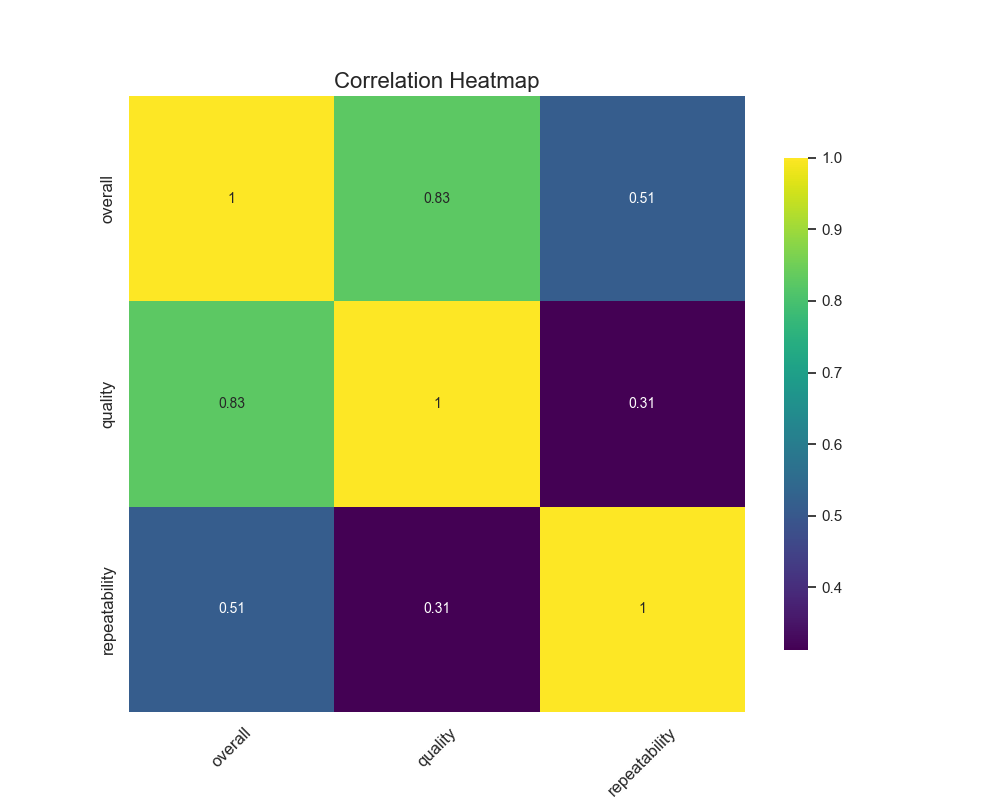
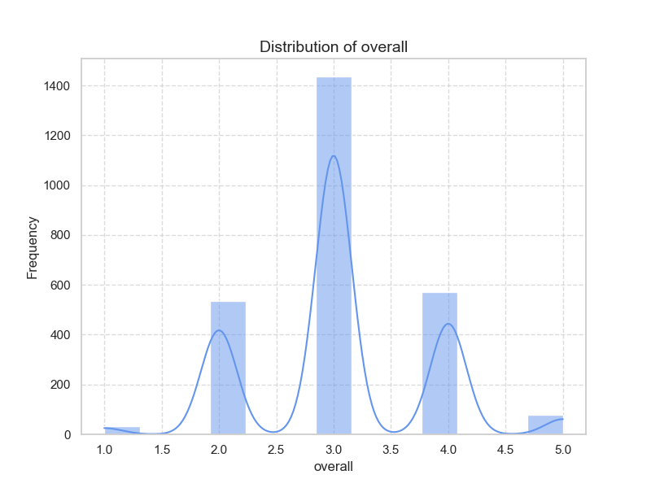
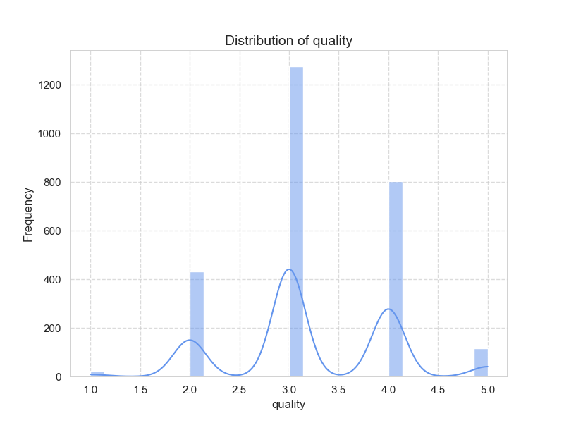
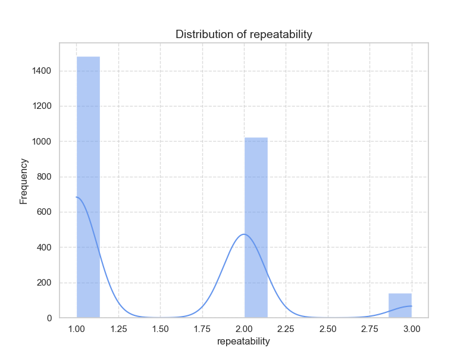

Based on the analysis of the provided data from the 'media.csv' file, here are key insights and trends:

### Summary Statistics:

1. **Date Information**:
   - There are 2,553 entries, with 2,055 unique dates.
   - The date with the highest frequency is '21-May-06', appearing 8 times.
   - There are 99 missing values in the 'date' column.

2. **Language**:
   - The dataset includes 2,652 entries and 11 unique languages.
   - 'English' is the most frequent language, occurring 1,306 times. No missing values in the language category.

3. **Type of Media**:
   - The dataset contains 2,652 entries categorized into 8 types, with 'movie' being the most common (2,211 occurrences). No missing values in the media type.

4. **Titles**:
   - There are 2,652 entries with 2,312 unique titles, indicating a variety of media covered.
   - The most common title is 'Kanda Naal Mudhal', which appears 9 times.

5. **Produced By**:
   - The 'by' category has 2,390 entries and 1,528 producers. The most frequent producer is 'Kiefer Sutherland' (48 occurrences).
   - There are 262 missing values in the 'by' column.

6. **Overall Ratings**:
   - The mean rating for 'overall' is approximately 3.05, with a standard deviation of 0.76. The ratings range from 1 to 5.
   - The median (50th percentile) rating is also 3.

7. **Quality Ratings**:
   - The quality ratings show a higher mean of 3.21, with a standard deviation of 0.80. It also ranges from 1 to 5.
   - Like 'overall,' the median rating is 3.

8. **Repeatability**:
   - The mean repeatability score is about 1.49, with a standard deviation of 0.60, ranging from 1 to 3.

### Correlation Insights:

- There is a strong positive correlation (0.826) between overall satisfaction and quality ratings, indicating that higher quality ratings lead to higher overall ratings.
- A moderate correlation (0.513) between overall ratings and repeatability suggests that users are likely to rate media higher if they would repeat the experience.
- The correlation between quality and repeatability is lower (0.312), suggesting that while both aspects are related, they may be influenced by different factors.

### General Trends:

- It appears that English media, specifically movies, dominate the dataset.
- Most entries have ratings clustered around 3 for both overall and quality metrics, suggesting a moderate level of satisfaction.
- Missing values in 'date' and 'by' may impact the comprehensive analysis of the dataset.

### Areas Needing Further Analysis:

1. **Missing Data**: 
   - Investigate the impact of missing values, especially in 'date' and 'by'. 

2. **Language and Type Breakdown**: 
   - Analyze how ratings vary by language and media type. It may be beneficial to assess if certain types of media perform better in specific languages.

3. **Producer Analysis**: 
   - Explore the relationship between producers and quality or overall ratings, especially since 'Kiefer Sutherland' appears frequently.

4. **Trend Over Time**: 
   - Since there are unique dates, it would be helpful to evaluate trends over time to understand if ratings are improving or declining in specific timeframes.

5. **User Engagement**: 
   - Further analysis could focus on engagement metrics that may correlate with repeatability and overall ratings.

6. **Comparison Against Standards**: 
   - Assess whether the average ratings align with industry standards or public reviews.

By addressing these areas, you can better understand audience perceptions and interactions with the media represented in your dataset.

From the provided correlation matrix, we can make several observations about the relationships between the three variables: overall, quality, and repeatability.

### Key Variables and Their Correlations:

1. **Overall and Quality**: 
   - Correlation: **0.8259** (significant correlation)
   - Interpretation: This strong positive correlation suggests that higher quality is associated with a higher overall rating. 

2. **Overall and Repeatability**: 
   - Correlation: **0.5126** (moderate correlation)
   - Interpretation: This moderate correlation indicates that while there is a relationship between overall ratings and repeatability, it is not as strong as that between overall and quality.

3. **Quality and Repeatability**: 
   - Correlation: **0.3121** (weak correlation)
   - Interpretation: This weak correlation suggests that the relationship between quality and repeatability is less pronounced, indicating that other factors may influence these relationships.

### Possible Causal Relationships:

1. **Quality Influencing Overall**: 
   - Given the strong correlation between quality and the overall rating, it is reasonable to infer that improvements in quality could lead to enhanced overall assessments. This implies that ensuring high quality could be a key strategy for improving overall perceptions.

2. **Repeatability's Impact on Overall**: 
   - The moderate correlation between repeatability and overall suggests that consistency in the performance of a product or service could positively affect overall ratings, but this effect may be weaker than that of quality. This could suggest that while repeatability matters, it may primarily enhance the perceived quality rather than stand alone.

3. **Quality and Repeatability's Relationship**: 
   - The weak correlation between quality and repeatability indicates that these are somewhat independent factors. For example, a high-quality product may not necessarily be repeatable if it is difficult to produce consistently. This suggests that efforts to improve one variable (like quality) may not directly lead to improvements in the other (repeatability) unless deliberate actions are taken.

### Summary:
- **Key variables**: **Overall** and **Quality** exhibit a significant positive correlation.
- Quality is likely a driving factor for enhancing overall ratings.
- Repeatability contributes to overall perceptions, but its influence is weaker.
- Quality and repeatability may not directly influence each other and may require separate strategies for enhancement.

In practice, businesses or organizations looking to improve their overall quality ratings should focus first on enhancing the quality of their offerings while also considering initiatives to improve repeatability as a complementary strategy.

